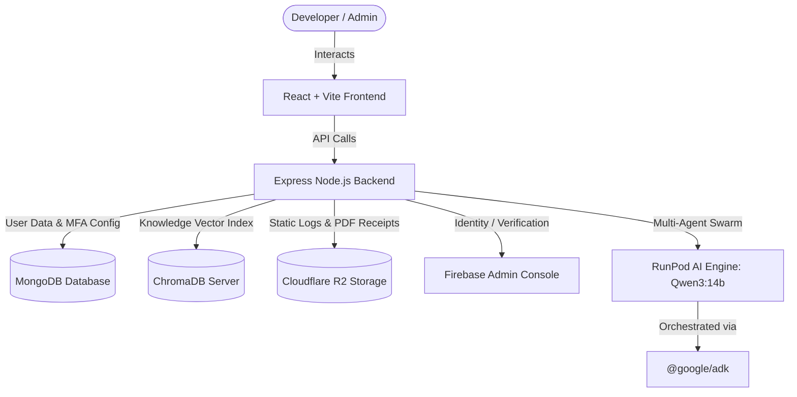

# CloudPilot 🚀

CloudPilot is an enterprise-grade, AI-driven infrastructure orchestration platform. It leverages a collaborative multi-agent swarm to analyze codebase structures, select the optimal cloud hosting layout, optimize pricing models, and execute secure production deployments.

---

## 🎯 Project Scope

Deploying and managing cloud infrastructure can be complex and cost-inefficient. CloudPilot automates the entire lifecycle through a collaborative swarm of 9 specialized AI agents:
1. **Code Analysis Agent**: Scans codebase structures, catalogs libraries, and parses project framework configurations.
2. **Platform Selection Agent**: Identifies optimal target hosts (Vercel, Render, AWS, GCP) fitting the runtime specifications.
3. **Architecture Agent**: Designs the service networking model, cluster topologies, and multi-service relationships.
4. **Cost Optimization Agent**: Synthesizes multi-provider pricing models to adjust resources and minimize hosting budgets.
5. **Deployment Agent**: Builds deployment steps, handles git-integrated pipelines, and provisions DNS/SSL.
6. **Monitoring Agent**: Tracks runtime metrics, latency spikes, and system traffic flows.
7. **Incident Response Agent**: Executes self-healing tasks, restarting crashed containers and rerouting networking.
8. **Security Agent**: Assesses system vulnerabilities, maps access control scopes, and keeps keys encrypted at-rest.
9. **Documentation Agent**: Generates system setup guides, API specs, and cluster topologies.

---

## 🏗️ System Architecture

CloudPilot is built using a modern decoupled architecture:



### Tech Stack
* **Frontend**: React (v19), Vite, Vanilla CSS.
* **Backend**: Node.js, Express, MongoDB (Mongoose), ChromaDB (Vector DB).
* **AI/LLM Swarm**: Google ADK, RunPod Qwen3:14b LLM, nomic-embed-text for embeddings.
* **Security & Auth**: Firebase Authentication, Speakeasy (TOTP Multi-Factor Authentication), JWT.
* **Storage**: Cloudflare R2 (S3-compatible API).

---

## ⚙️ Environment Configuration

You must configure the environment variables in both the `backend` and `frontend` folders. 

### 1. Backend Environment Variables (`backend/.env`)
Create `backend/.env` based on `backend/.env.example`:

| Key | Example Value | Description |
| --- | --- | --- |
| `PORT` | `5000` | Local backend service port |
| `MONGO_URI` | `mongodb://localhost:27017/cloudpilot` | MongoDB connection connection string |
| `JWT_SECRET` | `your_jwt_secret_key` | Secret key used for signing JWTs |
| `CLOUDFLARE_R2_*` | `access_key_id`, etc. | Storage bucket credentials for logs/receipts |
| `SMTP_*` | `smtp.mailtrap.io`, etc. | SMTP mailer settings for OTPs and invitations |
| `FIREBASE_*` | `firebase-project-id`, etc. | Firebase credentials for administrative authentication |
| `GITHUB_*` | `oauth_client_id`, etc. | GitHub OAuth settings for repo linking |
| `RUNPOD_BASE_URL` | `https://api.runpod.ai/.../openai/v1` | URL for the OpenAI-compatible Qwen completions API |
| `RUNPOD_API_KEY` | `runpod_api_key` | RunPod authorization API key |
| `CHROMA_URL` | `http://localhost:8000` | Endpoint for Chroma vector database |
| `CREDENTIALS_ENCRYPTION_KEY` | `openssl rand -base64 32` | Key for AES-256-GCM encryption of cloud tokens at rest |

### 2. Frontend Environment Variables (`frontend/.env`)
Create `frontend/.env` based on `frontend/.env.example`:

| Key | Example Value | Description |
| --- | --- | --- |
| `VITE_API_URL` | `http://localhost:5000` | Backend API endpoint |
| `VITE_FIREBASE_API_KEY` | `your-firebase-key` | Firebase client API key |
| `VITE_FIREBASE_AUTH_DOMAIN` | `auth-domain.firebaseapp.com` | Firebase authorization domain |

---

## 🚀 Getting Started

### Prerequisites
Make sure you have the following installed locally:
- **Node.js** (v18.x or higher)
- **MongoDB** (running locally or via MongoDB Atlas)
- **Docker & Docker Compose** (required for starting ChromaDB)

### Step 1: Start Chroma Vector Database
ChromaDB is used to store RAG context for our deployment configuration. Spin it up using the Docker Compose file in the root directory:
```bash
docker compose up -d
```

### Step 2: Set Up and Run the Backend
1. Navigate to the backend directory:
   ```bash
   cd backend
   ```
2. Install dependencies:
   ```bash
   npm install
   ```
3. Copy environment configuration:
   ```bash
   cp .env.example .env
   # Open .env and fill in active keys
   ```
4. Start in development mode:
   ```bash
   npm run dev
   ```
   *The backend will boot up on `http://localhost:5000`.*

### Step 3: Set Up and Run the Frontend
1. Open a new terminal and navigate to the frontend directory:
   ```bash
   cd frontend
   ```
2. Install dependencies:
   ```bash
   npm install
   ```
3. Copy environment configuration:
   ```bash
   cp .env.example .env
   # Open .env and fill in Firebase details
   ```
4. Start in development mode:
   ```bash
   npm run dev
   ```
   *The frontend will boot up on `http://localhost:5173` (or the next available port).*

---

## 🔒 Security & Multi-Factor Authentication

CloudPilot features a robust security architecture including:
* **AES-256-GCM Encryption**: Render and Vercel credentials are encrypted at-rest in MongoDB.
* **OTP Multi-Factor Authentication (MFA)**: Built-in TOTP verification. Users can scan a QR code with Google Authenticator or Microsoft Authenticator.
* **Trusted Devices**: Users can mark devices as "trusted" upon verifying login codes, exempting them from MFA challenge prompts for a configurable duration.

---

## 📂 Project Directory Structure

```text
CloudPilot/
├── backend/
│   ├── config/          # DB connection & server configs
│   ├── controllers/     # API request handlers (Auth, MFA, Deployments)
│   ├── middleware/      # JWT validation & role controls
│   ├── models/          # Mongoose DB schemas (User, AuditLogs)
│   ├── routes/          # REST route endpoints
│   ├── services/        # Third-party adapters (RunPod, R2, NodeMailer)
│   └── index.js         # Backend entrypoint
├── frontend/
│   ├── public/          # Static browser assets
│   ├── src/
│   │   ├── assets/      # Vector icons and logos
│   │   ├── components/  # Reusable UI elements (Navbar, Stepper, SecurityCard)
│   │   ├── pages/       # Router layouts (Dashboard, Admin, ViewProfile)
│   │   ├── App.jsx      # Global React Router definitions
│   │   └── main.jsx     # Frontend entrypoint
│   ├── vite.config.js   # Vite bundle setup
│   └── package.json
└── docker-compose.yml   # Chroma container configuration
```
